Jivejdon has been coded using the AI vibe-code tool, with the development environment being VSCode + Copilot.

# Jivejdon
Jivejdon is a notebook, knowledge graph, and knowledge system with DDD + DomainEvents/Event Soucing/CQRS + clean architecture/Hexagonalarchitecture, powered by [jdonframework](https://github.com/banq/jdonframework). 

# Features: 
When posting, it provides functions such as keywords, topics, and themes, organizing posts together in the form of links. They are presented to human readers in a [https://www.jdon.com/threads/](chronological sequence) and to AI readers in a [https://www.jdon.com/tag/](semantic structure) like a theme garden. It is suitable for enterprises to manage their internal knowledge systems, and when combined with intelligent agents, it can serve as the enterprise's second brain.

refer:[https://www.jdon.com/90352-markdown-knowledge-graph-curation.html](Markdown files themselves are the graph database for intelligent agents!)
# Demo
You can check out the canonical deployment of Jivejdon at [https://www.jdon.com/](https://www.jdon.com/forum/)(NginX+Tomcat+JDK8+MySQL)

[github](https://github.com/banq/jivejdon)

[gitee](https://gitee.com/banqjdon/jivejdon)


# Domain-centric Architecture.

Domain-centric architecture is a new way to design modern world enterprise applications.

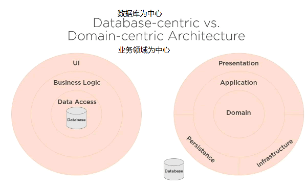

# Use Case

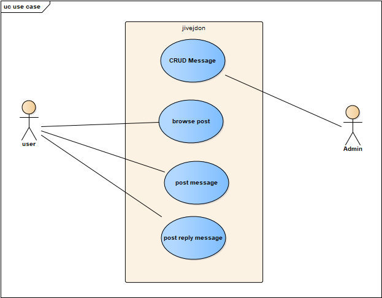

# DDD Aggregate Model

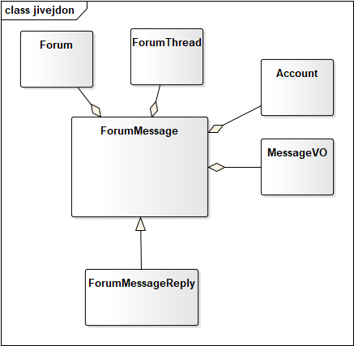

There are two aggregate roots in jivejdon: FormThread and ForumMessage(Root Message).

[com.jdon.jivejdon.domain.model.ForumMessage](https://github.com/banq/jivejdon/blob/master/src/main/java/com/jdon/jivejdon/model/ForumMessage.java) is a rich model, no "public" setter method, all setter methods are "private":

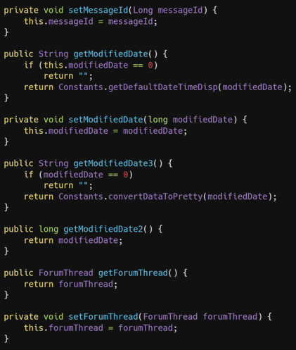

Domain Model principles:

1. **High level of encapsulation*
All members' setter methods are `private`` by default, then `internal`. need heavy builder pattern to create aggregate root!

2. **High level of PI (Persistence Ignorance)*
No dependencies on infrastructure, databases, or other stuff. All classes are POJO.

The customer/supply model from jdonframework can separate the domain model from Persistence/Repository.

All business datas outside of the domain is packed in a DTO anemic model([AnemicMessageDTO](https://github.com/banq/jivejdon/blob/master/src/main/java/com/jdon/jivejdon/infrastructure/dto/AnemicMessageDTO.java)), so business rules in the aggregate root entity will not leak outside of the domain.

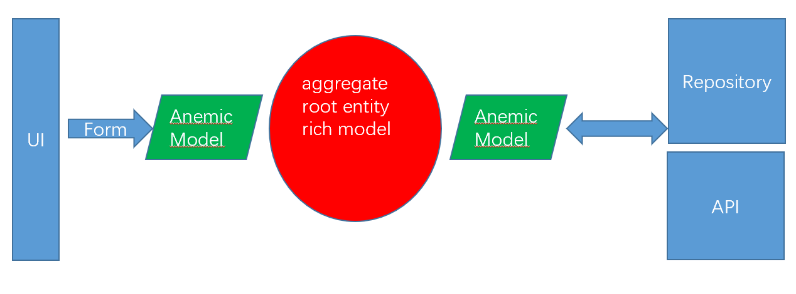

These DTO anemic models can also be packed in Command and Domain Events， so they are managed in DDD ubiquitous business language.

3. **Rich in behavior**

All business logic is located in Domain Model. No leaks to the application layer or other places.

4. **Low level of primitive obsession**

Primitive attributes of Entities grouped together using ValueObjects.

[MessageVO](https://github.com/banq/jivejdon/blob/master/src/main/java/com/jdon/jivejdon/domain/model/message/MessageVO.java) is a value Object and has two attributes for message content: subject/body.

# Clean architecture/Hexagonal architecture

[Why clean architecture/Hexagonal architecture are a better choice for "Implementing Domain Driven Design"](https://github.com/banq/jivejdon/issues/8)

JiveJdon is developed with JdonFramework that supports the Customer/Supply or pub-sub model, this model can separate domain logic from infrastructure, databases, and other stuff.


JiveJdon Hexagonal_architecture:

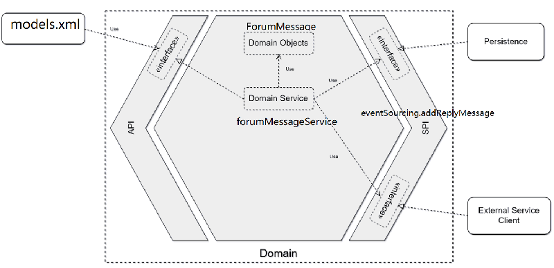

here is the package view of jivejdon:

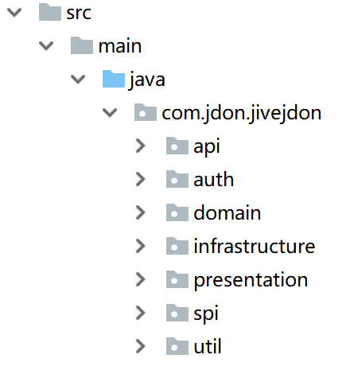

Invoking path:

```
presentation -> api -> domain -> spi ->infrastructure
```

[models.xml](https://github.com/banq/jivejdon/blob/master/src/main/resources/com/jdon/jivejdon/domain/model/models.xml) is an adapter for presentation:

```
	<model key="messageId" class="com.jdon.jivejdon.infrastructure.dto.AnemicMessageDTO">
		<actionForm name="messageForm"/>
		<handler>
			<service ref="forumMessageService">

				<createMethod name="createReplyMessage"/>

			</service>
		</handler>
	</model>
```

When a user post a replies message, a POST command from the presentation will action the createReplyMessage method of [forumMessageService](https://github.com/banq/jivejdon/blob/master/src/main/java/com/jdon/jivejdon/api/impl/message/ForumMessageServiceImpl.java) in API :

```
public interface ForumMessageService {

	Long createReplyMessage(EventModel em) throws Exception;
	....

}
```

The forumMessageService will delegate the responsibility to the aggregate root entity [ForumMessage](https://github.com/banq/jivejdon/blob/master/src/main/java/com/jdon/jivejdon/domain/model/ForumMessage.java),

The createReplyMessage() method of the forumMessageService will send a command to the addChild() method of [ForumMessage](https://github.com/banq/jivejdon/blob/master/src/main/java/com/jdon/jivejdon/domain/model/ForumMessage.java) that is too a command handler of CQRS:

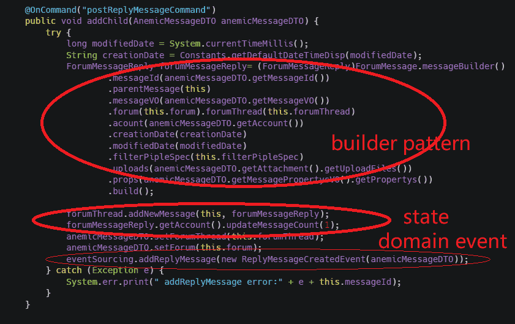

@OnCommand("postRepliesMessageCommand") annotation make addChild() being a command handler, the annotation is from pub-sub model of jdonframework, it can make
this method executed with a [single-writer pattern](http://mechanical-sympathy.blogspot.co.uk/2011/09/single-writer-principle.html) - no blocked, no lock, high concurrent. only one thread/process invoking this update method.

"event-sourcing.addReplyMessage" will send a "ReplyMessageCreatedEvent" domain Event to infrastructure layer such as Repository. separate domain logic from infrastructure, databases, and other stuff.

Domain event "ReplyMessageCreatedEvent" occurring in the domain is saved in the event store "jiveMessage", this is a message posted events table. the event can be used for reconstructing the latest replies state of a thread, events replay is in [ForumThreadState](https://github.com/banq/jivejdon/blob/master/src/main/java/com/jdon/jivejdon/domain/model/ForumThreadState.java) .

# CQRS architecture

CQRS addresses separate reads and writes into separate models, using commands to update data, and queries to read data.

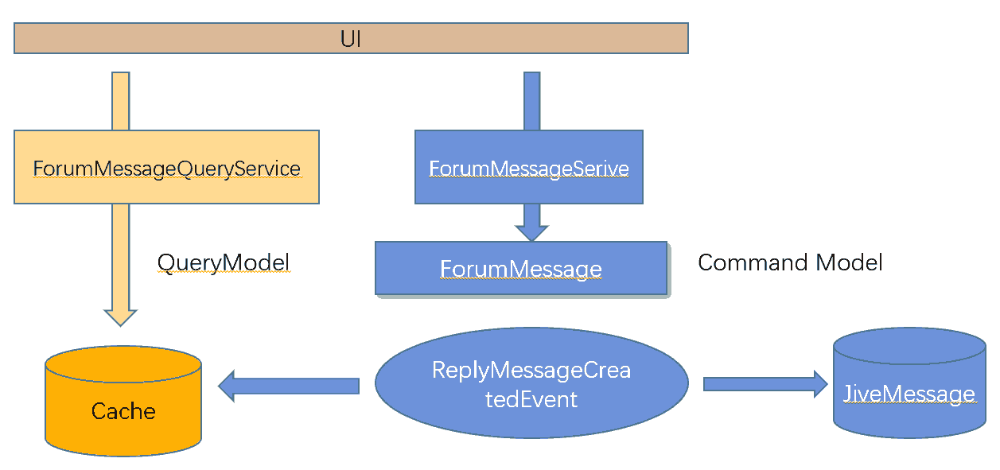

In jivejdon ForumThread and ForumMessage are saved in the cache, the cache is a snapshot of even logs, if an update command activates one of these models, they will send domain events to clear the cache data, the cache is similar to the database for query/read model, the consistency between with cache and the database for command model is maintained by the domain events such as "ReplyMessageCreatedEvent".

The domain event "ReplyMessageCreatedEvent" do three things:

1. add a new post message to "jiveMessage" (events log)
2. clear the query cache (CQRS)
3. update/project the latest replies state of a thread (event project to state)

# Event Sourcing

Posting a message is an event, modifying the latest replies status for one thread.

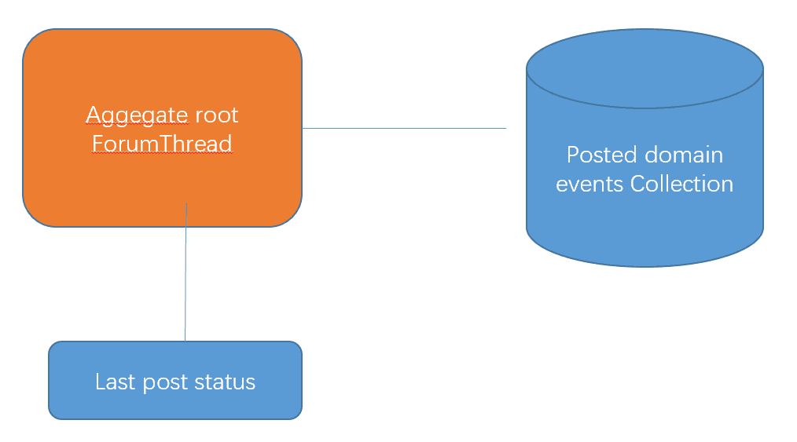

How to get the latest replies status for one thread? we must iterate all posted events collection.

JiveMessage is a database storing posted events in time order, with one SQL we can reduce them chronologically to get the current state: the latest posted event:

```

SELECT messageID from jiveMessage WHERE  threadID = ? ORDER BY modifiedDate DESC

```

This SQL can quickly find the latest replies post, similar to replaying all posted events to project the current state.

In jiveThread table there is no special field for the latest replies state, all states are from posted events projection. (projection can use SQL!)

When a user posts a new ForumMessage, a ReplyMessageCreatedEvent event will be saved to the event store: JiveMessage, simultaneously refreshing the snapshot of the event: ForumThreadState.

In [ForumThreadState](https://github.com/banq/jivejdon/blob/master/src/main/java/com/jdon/jivejdon/domain/model/ForumThreadState.java) there is another method for projecting state from the database, if we want to get the count of all message replies, its projectStateFromEventSource() method can do this:

```

	public void projectStateFromEventSource() {
		DomainMessage dm = this.forumThread.lazyLoaderRole.projectStateFromEventSource(forumThread.getThreadId());
		OneOneDTO oneOneDTO = null;
		try {
			oneOneDTO = (OneOneDTO) dm.getEventResult();
			if (oneOneDTO != null) {
				latestPost = (ForumMessage) oneOneDTO.getParent();
				messageCount = new AtomicLong((Long) oneOneDTO.getChild());
				dm.clear();
			}
		} catch (Exception e) {
			e.printStackTrace();
		}
	}

```

lazyLoaderRole.projectStateFromEventSource will send a "projectStateFromEventSource" message to [ThreadStateLoader](https://github.com/banq/jivejdon/blob/master/src/main/java/com/jdon/jivejdon/spi/pubsub/reconstruction/impl/ThreadStateLoader.java):

```
public void onEvent(EventDisruptor event, boolean endOfBatch) throws Exception {
		try {
			ForumMessage latestPost = forumAbstractFactory.getMessage(lastMessageId);

			long messagereplyCount;
			long messageCount = messageQueryDao.getMessageCount(threadId);
			if (messageCount >= 1)
				messagereplyCount = messageCount - 1;
			else
				messagereplyCount = messageCount;

			OneOneDTO oneOneDTO = new OneOneDTO(latestPost, messagereplyCount);
			event.getDomainMessage().setEventResult(oneOneDTO);

		} catch (Exception e) {
			e.printStackTrace();
		}

	}

```

ThreadStateLoader will reconstruct the current state by SQL from MySQL database, the SQL is "select count(1) ...".
and now we refreshed the current state of a ForumThread: the count for all message replies.

Domain model mapping to the database schema:

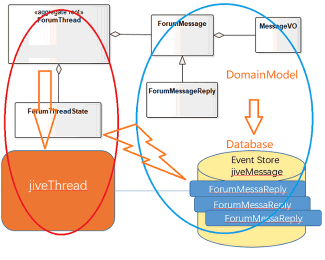

Most of the stuff in aggregate root "ForumThread" mapping to jiveThread table, but its "rootMessage" mapping to jiveMessage table, and its state "ForumThreadState" is projected from jiveMessage table.
In jiveMessage table, there are two kinds of ForumMessage: root message and replies messages, one thread only has one root message but has many replies messages, these replies messages are replies-posted event log. in the domain model,replies messages (FormMessageReply) is a subclass of Root Message(FormMessage).

There is a new pattern between strictly event sourcing and CRUD, it is DomainEvents List, any element in List can be removed, no appending!
# Compile & Package & Install

```
git clone https://github.com/banq/jivejdon.git (git clone https://gitee.com/banqjdon/jivejdon.git)
cd jivejdon
mvn clean install -U
```

if clone error, please remove all downloaded files in Maven local repository and try "mvn clean install -U" again, or clone from https://gitee.com/banqjdon/jivejdon


if mvn compile error, please configure your mirror Maven center repository.

# Runtime download

(1) Docker:

```
1. docker pull mysql:latest
2. docker run -itd --name mysql-test -p 3306:3306 -e MYSQL_ROOT_PASSWORD=123456 mysql
   
   docker ps 

   docker cp ddl/mysql_jivejdon.sql  container_id:/mysql_jivejdon.sql
   docker cp ddlmysql_security.sql  container_id:/mysql_security.sql
   
   
   docker exec -it container_id bash
   

   mysql -u root -p 
   create database jivejdon character set utf8;

   mysql -u root -p jivejdon < /mysql_jivejdon.sql
   mysql -u root -p jivejdon < /mysql_security.sql

3. docker build -t jivejdonweb -f Dockerfile.web .
4. docker run  -p 8080:8080 jivejdonweb
```

browser : http://$DOCKER_HOST_IP:8080

(2) [jivejdon+tomcat+mysql](https://pan.baidu.com/s/15yqyo6GBx8OHmpoTpweQ3A)
download passwd:97j9

Start the server:

1. mysql-5.6.15-winx64\bin\mysqld.exe, and telnet 127.0.0.1 3306
2. apache-tomcat-7.0.37\bin\debug.bat

app: http://127.0.0.1:8080/

debug port:8000

you can debug jivejdon in IntelliJ Idea by connecting to 8000 port

## Document

[English install doc](./doc/install_en.txt)

[Chinese install doc](./doc/install_cn.txt)

[Chinese design doc](https://www.jdon.com/ddd/jivejdon/1.html)

## Donation
### Please donate this project because it is free!
<a href="https://coff.ee/banq" target="_blank"></a>
