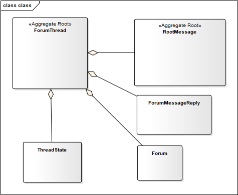

Jivejdon
=========================================

Jivejdon is a full DDD example powered by [jdonframework](https://github.com/banq/jdonframework) 
 it has 
running  for over ten years
at: [https://www.jdon.com/forum](https://www.jdon.com/forum)

Use Case
------------------------------------

DDD Aggregate Model
------------------------------------

Clean architecture
--------------------------------------

Install
------------------------------------
Docker:
1. mvn package
2. docker build -t jivejdondb -f Dockerfile.db .
3. docker run  -p 3306:3306  -e MYSQL_ROOT_PASSWORD=123456 jivejdondb
4. docker build -t jivejdonweb -f Dockerfile.web .
5. docker run  -p 8080:8080 jivejdonweb

browser : http://192.168.99.100:8080

english: [doc/install_en.txt](./doc/install_en.txt)

chinese: [doc/install_cn.txt](./doc/install_cn.txt)

Compile and Deploy
-------------------------------
Please modify the value of 'deploy.dir' in build.properties, and then Run Ant:
ant
